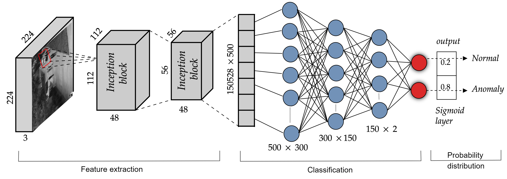
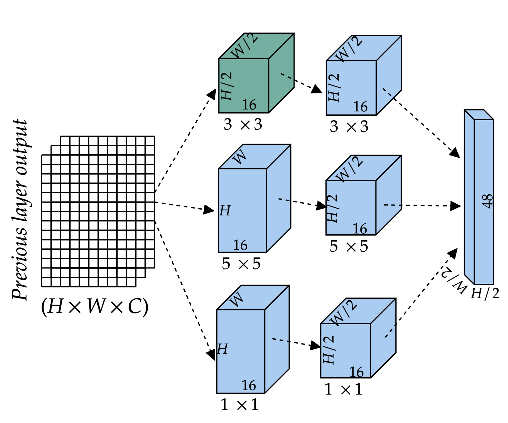
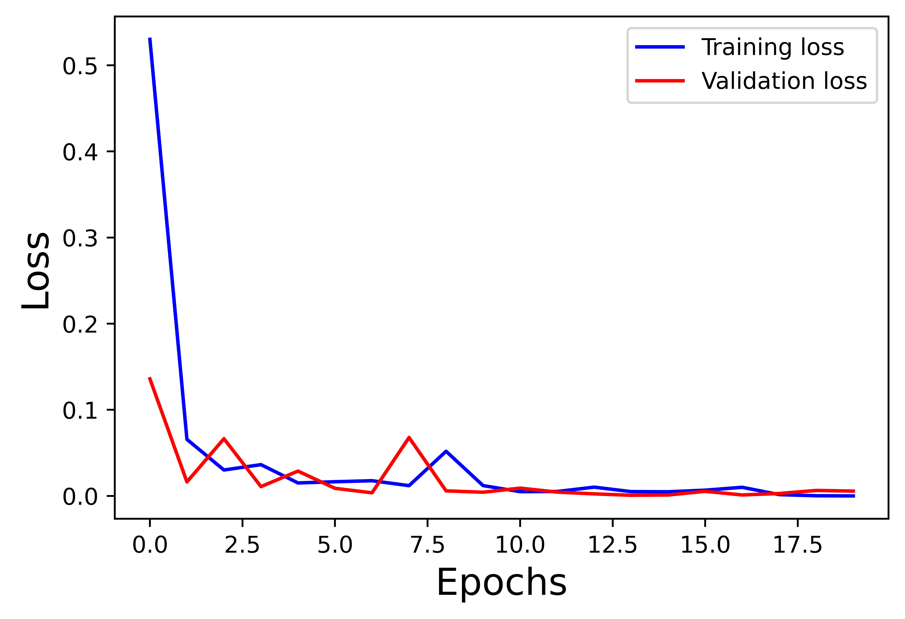
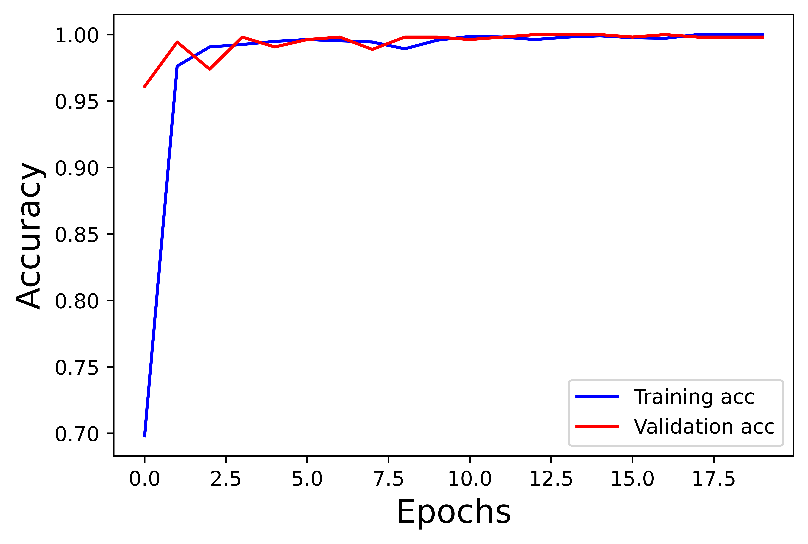

# Anomaly Detection in Video Surveillance using Supervised Inception Encoder Approach

## Description
This project implements a supervised anomaly detection method for video surveillance systems. The approach utilizes an Inception encoder model for feature extraction and classification, enabling the detection of anomalies in video data.

## Model Architecture
The model architecture used in this project consists of multiple convolutional layers, Inception modules, and fully connected layers for feature extraction and classification. The detailed architecture is as follows:
<p align="center">
  <figure>
    
    <figcaption>Figure 1: The proposed methodology is visually depicted through three primary stages. The first stage is dedicated
to extracting intrinsic features, followed by the second stage, which focuses on learning intricate feature
relationships. The final stage involves the output layer, where the network generates predictions</figcaption>
  </figure>
</p>
<p align="center">
  <figure>
    
    <figcaption>Figure 2: Illustration of the Inception block used for the feature extraction</figcaption>
  </figure>
</p>

## Loss and Accuracy Plots
The following plots display the training and validation loss, as well as the training and validation accuracy during the model training process:
<!-- Display two images side by side with captions -->
<div style="display: flex;">
  <div style="flex: 50%; padding: 5px;">
    
    <p style="text-align: center;">Figure 1: Description of Image 1</p>
  </div>
  <div style="flex: 50%; padding: 5px;">
    
    <p style="text-align: center;">Figure 2: Description of Image 2</p>
  </div>
</div>


<p align="center">
  <figure>
    
     
    <figcaption>Figure 3:Train and validation loss plot </figcaption>
  </figure>
</p>
<p align="center">
  <figure>
    
    <figcaption>Figure 4:Training and Validation Accuracy Plot </figcaption>
  </figure>
</p>
## Requirements
- please see requirements.txt file

## Installation
1. Clone the repository to your local machine:
   ```
   git clone https://github.com/angachary/Inception_Encoder_VAD.git
   cd anomaly-detection
   ```

2. Install the required dependencies using pip:
   ```
   pip install -r requirements.txt
   ```

## Usage
1. Prepare your dataset by organizing anomaly and non-anomaly video frames in separate directories within the dataset folder.

2. Update the `datasetname` variable in the code with your dataset name.(Ped1,Ped2, CUHK Avneue)

3. Execute the main script to train and test the anomaly detection model:
- The original code is implemented in a Jupyter notebook (Inception_encoder.ipynb). You may convert it to a normal '.py' (anomaly_detection.py) file and run it.
   ```
   python anomaly_detection.py
   ```

4. Monitor the training progress and view the evaluation metrics and visualizations generated during the process.

## Files and Structure
- `Inception_encoder.ipynb`: Main script containing the code for training and testing the anomaly detection model.
- `dataset/`: Directory containing the dataset with anomaly and non-anomaly videos.
- `results/`: Directory contains the sample results for UCSD Ped2 dataset.
- `requirements.txt`: File listing all required dependencies for the project.

## Results
Upon running the script, the model will be trained using the specified dataset and hyperparameters. The evaluation results, including accuracy, loss, precision, recall, and visualizations such as training/validation curves and predicted vs. true labels, are shown in the notebook file.


## Citation
If this code or concept is useful to your work, please cite our paper:
```
@article{Kommanduri_2024,
  title={Anomaly detection in video surveillance: a supervised inception encoder approach},
  ISSN={1573-7721},
  url={http://dx.doi.org/10.1007/s11042-024-18604-2},
  DOI={10.1007/s11042-024-18604-2},
  journal={Multimedia Tools and Applications},
  publisher={Springer Science and Business Media LLC},
  author={Kommanduri, Rangachary and Ghorai, Mrinmoy},
  year={2024},
  month=feb
}
```


"# Inception_Encoder_VAD" 
"# VAD_Inception_Encoder" 
